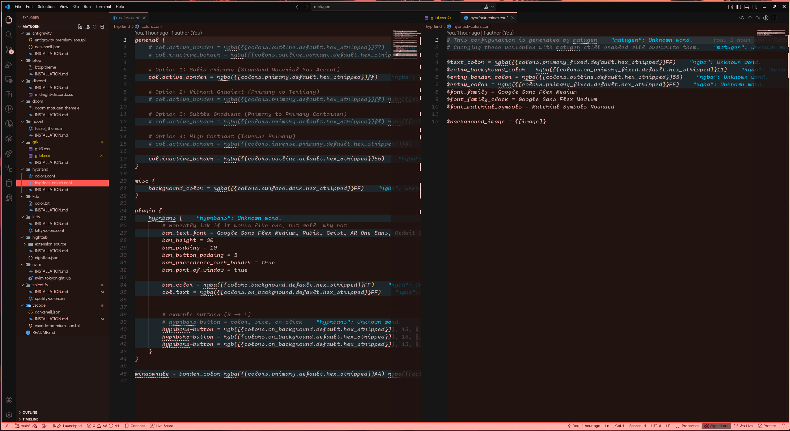
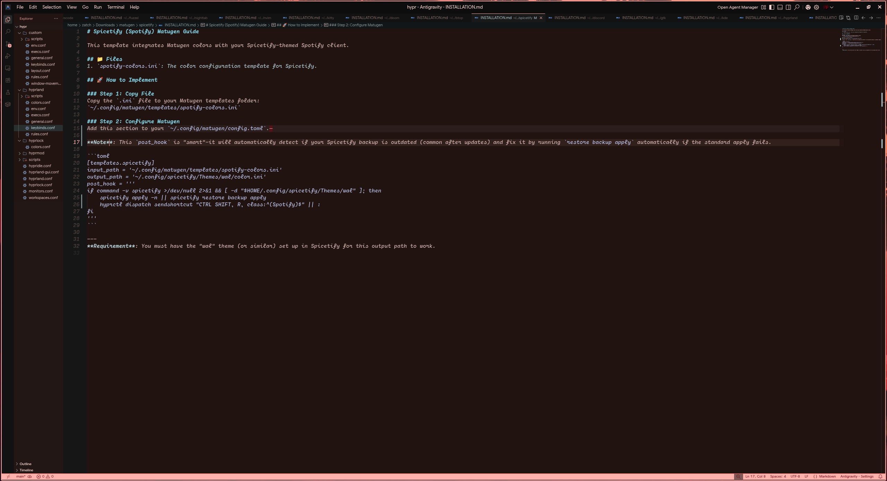
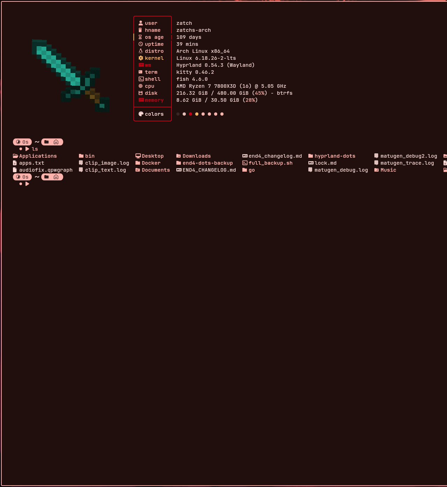
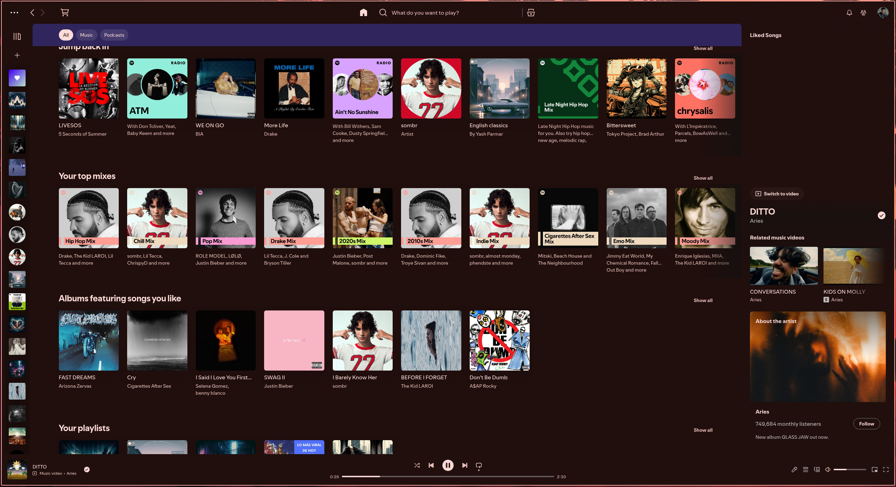
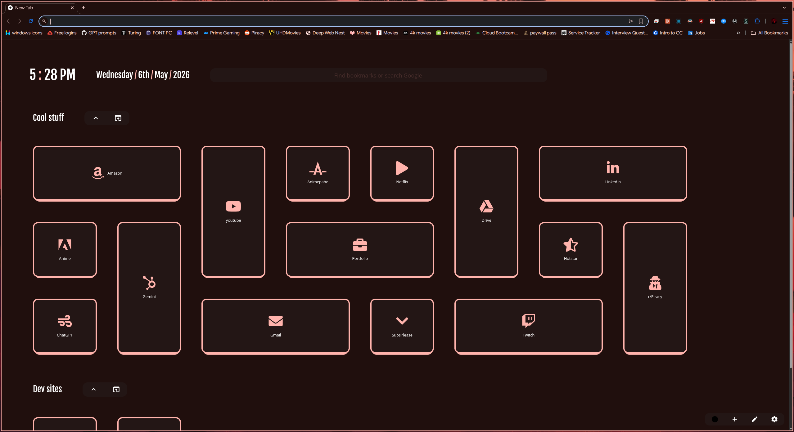

# 🌌 Matugen Dynamic Theming Ecosystem

Welcome to the ultimate Matugen dynamic theming export. This collection contains all the templates, settings, and scripts required to sync your entire desktop experience with your wallpaper colors.

## 📁 How to Use This Export
Each application has its own dedicated folder. Inside each folder, you will find:
1. **Template Files**: The `.tpl`, `.json`, or `.css` files used by Matugen.
2. **INSTALLATION.md**: A detailed, step-by-step guide on how to add that specific app to your system, including the exact code for your `config.toml`.

---

## 🚀 Managed Applications & Systems

### 🎨 Core Desktop Experience
*   **Hyprland & Hyprlock**: Dynamic window borders and lock screen themes.
*   **GTK 3 & 4**: Consistent styling for system apps and file managers.
*   **KDE Plasma**: Integrated color schemes for the Plasma desktop.
*   **Fuzzel**: A minimalist, color-synced application launcher.

### 💻 Development Tools
*   **VS Code (Premium)**: Instant, flicker-free color updates for your editor.
    
*   **Antigravity**: A dedicated theme for the Antigravity VS Code fork.
    
*   **Neovim (Tokyonight)**: Lua-based color overrides for your terminal editor.
*   **Doom Emacs**: Real-time theme reloading for the Emacs ecosystem.

### 🛠️ Terminal & System
*   **Kitty**: High-performance terminal colors that refresh on the fly.
    
*   **btop**: A stylish system monitor with custom color palettes.

### 🌐 Web & Social
*   **Discord (Vesktop)**: Custom CSS for the Midnight theme.
*   **Spicetify (Spotify)**: Automated color application for your music player.
    
*   **nightTab**: A fully custom browser extension with a Matugen bridge.
    

---

## 🛠️ General Implementation Steps
1. **Prerequisite**: Install [Matugen](https://github.com/InioAsman/matugen).
2. **Templates**: Copy the files from each subfolder to your `~/.config/matugen/templates/` directory.
3. **Configuration**: Open your `~/.config/matugen/config.toml` and add the sections provided in each app's `INSTALLATION.md`.
4. **Activation**: Set the corresponding theme in each application (e.g., set VS Code to "Matugen Dynamic Theme").
5. **Generate**: Run `matugen image /path/to/wallpaper.png` and watch your system transform!

---
